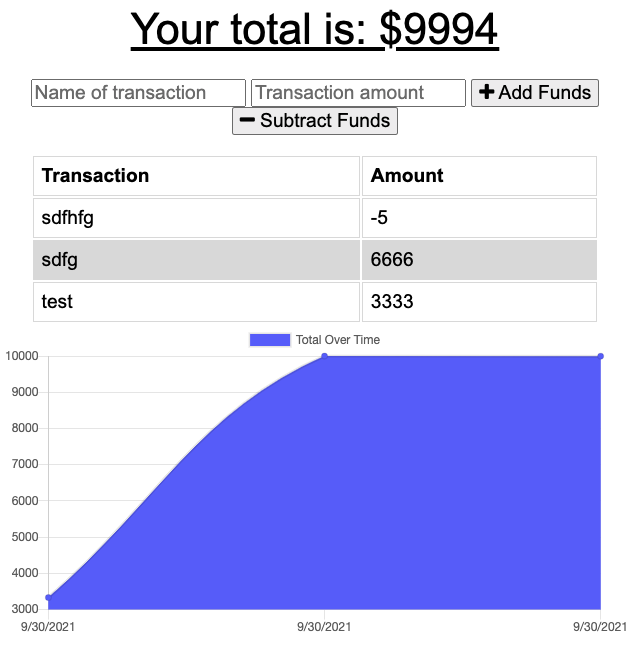
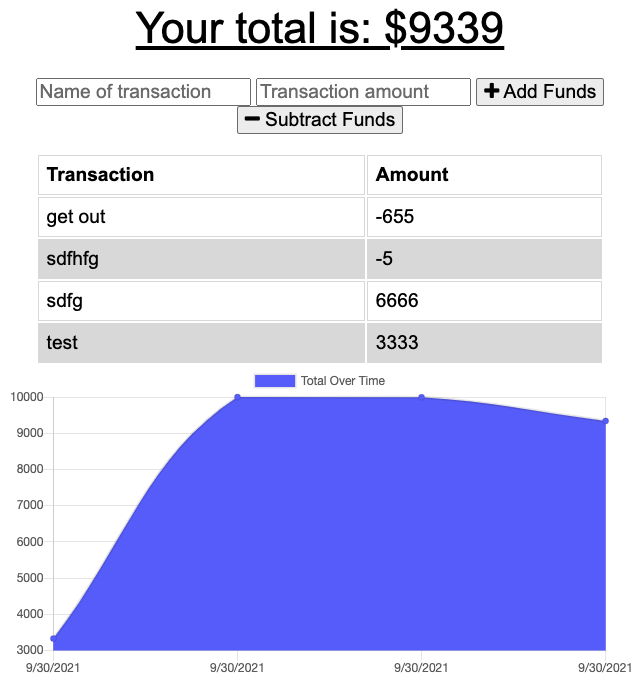
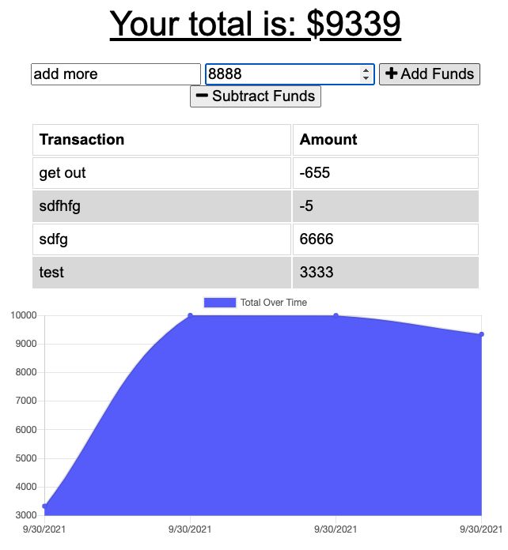
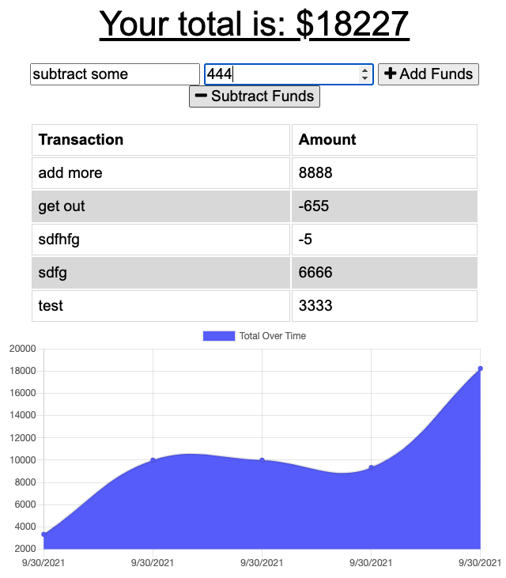
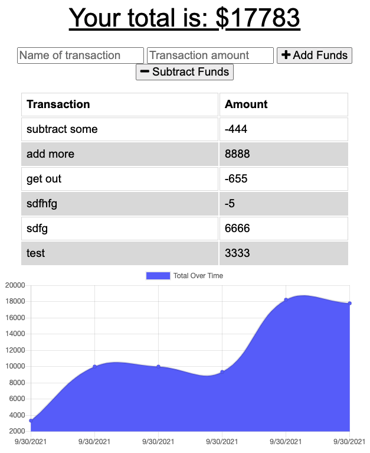

# Project Title
budget-tracker 

# Description
This application is a fully functional budget tracker to help your business exceed business goals while minimizing budget costs.

Follow this [link](https://github.com/abergtra/challenge-19) for the GitHub repository.

# Table of Contents 
* [Installation](#-Installation)
* [Usage](#-Usage)
* [License](#-Installation)
* [Contributing](#-Contributing)
* [Tests](#-Tests)
* [Questions](#-Questions)
    
# Installation
There are no special instructions for installation! Just open the live url.

# Usage
Go to this [live url](https://challenge-19.herokuapp.com/) on your favorite browser.

Add funds to your budget:

Subtract funds from your budget:

Your actions are logged and budget updated:

# License 
[License: MIT](https://opensource.org/licenses/MIT) 
* As this list provided is not comprehensive, if you need another license, contact the author for additional options. 

# Contributing 
Please contact the author about contributing.

# Tests
There are no tests available for this application.

# Questions
* GitHub Username: abergtra
* Contact Email: asher.bergtraun@gmail.com
